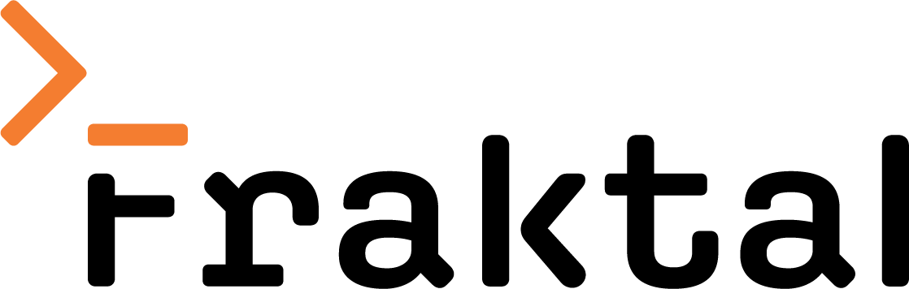

<p align="center">
  
</p>

# Fraktal CLI

> **Merknad om grener:** Du er på `fraktal/main` — Fraktals arbeidsgren.
> Repoens default-gren `main` speiler `openai/codex` urørt på grunn av
> en org-policy som låser default til `main`. Alle Fraktal-spesifikke
> endringer (binærnavn, Azure-profil, telemetri-av, denne dokumentasjonen)
> ligger her. Hvis du landet på `main` og lurer på hvor Fraktal-koden er
> — den er her. Bytt gren øverst til venstre på GitHub, eller `git
> checkout fraktal/main` lokalt. Se [`RELEASING.md`](./RELEASING.md) for
> hvorfor modellen ser slik ut.

**Fraktal CLI** er Fraktals interne kode-agent for terminalen. Det er en
lett fork av [OpenAIs Codex](https://github.com/openai/codex) som er
satt opp til å snakke med interne modeller — en lokal LLM som standard,
og Azure OpenAI med Entra ID-autentisering når du trenger en sterkere
modell.

> Det meste av funksjonaliteten kommer fra Codex selv. Forken legger kun
> til det som må endres for at den skal være vår: rebranding av
> binærnavnet, intern oppdateringssjekk, og telemetri som er slått av.
> Se [`RELEASING.md`](./RELEASING.md) for forholdet til oppstrøms.

---

## Status

Forken er fersk og under oppbygging. Følgende fungerer i dag:

- Binæret bygger og kjører som `fraktal` (ikke `codex`).
- Statsig-telemetri til OpenAI er slått av som standard.
- Oppdateringssjekken peker mot vår egen GitHub Release.
- **MCP-verktøy fungerer med lokale modeller** — tolerant navneoppslag
  så Ollama-modeller (qwen3.5, gemma4) kan kalle MCP-servere. Se
  [MCP-servere](#mcp-servere-med-lokale-modeller).

Følgende er planlagt, men ikke ferdig:

- **`fraktal-auth`** — hjelpeprogrammet som henter Entra-tokener for
  Azure OpenAI-profilen. Skal ligge i eget repo
  (`Fraktal-Norge-AS/fraktal-auth`).
- **Installasjonspakker** — Homebrew-tap for macOS/Linux og signert MSI
  for Windows. Inntil disse er på plass, må du bygge fra kilde.
- **Standard `~/.codex/config.toml`** levert av installeren. Inntil
  videre må du legge inn konfigurasjonen selv (mal nedenfor).

## Bygg fra kilde

Krever Rust (toolchain-versjon styres av `codex-rs/rust-toolchain.toml`,
rustup installerer riktig versjon automatisk).

```sh
git clone https://github.com/Fraktal-Norge-AS/fraktal-codex.git
cd fraktal-codex/codex-rs
cargo build --release -p codex-cli
```

Binæret havner i `codex-rs/target/release/fraktal` (eller `fraktal.exe`
på Windows). Legg det på `PATH` selv, eller bruk det direkte.

## Konfigurasjon

Konfigurasjonen ligger i `~/.codex/config.toml` (stien arves fra
oppstrøms — `CODEX_HOME` overstyrer hvis ønskelig). Når installeren er
klar vil den skrive en mal hvis filen mangler. Inntil videre:

```toml
# Standard: Fraktals Ollama-server (krever VPN / kontornett)
model_provider = "fraktal-ollama"
model = "qwen3.5:27b"                # generell modell med tool-calling
                                     # og thinking (~17 GB, 256K kontekst).
                                     # Andre modeller med tool-støtte på
                                     # ml-dev-titan:
                                     #   glm-4.7-flash:latest  (~19 GB, MoE)
                                     #   gemma4:26b            (~18 GB)
                                     # NB: deepseek-coder-v2:16b støtter
                                     # IKKE tool-calling og kan ikke brukes
                                     # av Fraktal-agenten.
                                     # Oppdatert liste + capabilities:
                                     #   curl .../api/tags
                                     #   curl .../api/show -d '{"model":"X"}'

[model_providers.fraktal-ollama]
name = "Fraktal Ollama (ml-dev-titan)"
base_url = "http://ml-dev-titan.fraktal.as:11434/v1"
# wire_api er "responses" som standard og er den eneste gyldige verdien.
# [fraktal] Oppdag modellene serveren faktisk har, og vis dem i /model.
# Når denne er på, spør Fraktal providerens /v1/models-endepunkt og lister
# hver rapporterte modell i velgeren — legg en ny modell på Ollama-serveren,
# og den dukker opp uten å redigere config. Uten flagget viser /model kun
# de innebygde GPT-modellene (de er irrelevante mot en Ollama-provider).
discover_models = true

# Bytt til Azure med: fraktal --profile azure
[profiles.azure]
model_provider = "fraktal-azure"
model = "gpt-5-codex"                # AOAI deployment-navn

[model_providers.fraktal-azure]
name = "Fraktal Azure OpenAI"
base_url = "https://fraktal-aoai.openai.azure.com/openai/deployments/gpt-5-codex"
wire_api = "responses"
requires_openai_auth = false

[model_providers.fraktal-azure.http_headers]
"api-version" = "2026-02-01"

[model_providers.fraktal-azure.auth]
command = "fraktal-auth"
args = ["token", "--scope", "https://cognitiveservices.azure.com/.default"]
refresh_interval_ms = 300000
timeout_ms = 10000

# Bytt til DeepInfra med: fraktal --profile deepinfra
# Krever en oversetter-proxy (se under) fordi Codex kun snakker
# Responses-API-et, mens DeepInfra kun tilbyr Chat Completions.
[profiles.deepinfra]
model_provider = "fraktal-deepinfra"
model = "kimi-k2-code"               # model_name definert i LiteLLM-proxyen

[model_providers.fraktal-deepinfra]
name = "DeepInfra (via LiteLLM-proxy)"
base_url = "http://localhost:4000/v1"   # LiteLLM-proxyens /v1/responses
wire_api = "responses"
requires_openai_auth = false
# Nøkkelen Fraktal sender til proxyen. Lokalt uten proxy-auth kan denne
# linjen droppes; i delt drift settes LiteLLMs master key her.
env_key = "LITELLM_MASTER_KEY"

# OpenRouter, direkte (wire_api = "chat") — INGEN oversetter-proxy, i
# motsetning til oppstrøms Codex som kun støtter Responses.
# Provideren defineres her; selve profilvalget (model/model_provider) ligger
# i en egen overlay-fil openrouter.config.toml (se under). Bytt til den med:
#   fraktal --profile openrouter
[model_providers.fraktal-openrouter]
name = "OpenRouter"
base_url = "https://openrouter.ai/api/v1"
wire_api = "chat"                    # [fraktal] direkte Chat Completions
requires_openai_auth = false
env_key = "OPENROUTER_API_KEY"      # fra https://openrouter.ai/keys
discover_models = true              # vis OpenRouters modeller i /model
```

> **Profiler er egne filer.** Denne forken bruker ikke `[profiles.x]`-tabeller
> i `config.toml` (de gir nå en feil). En profil `x` er en overlay-fil
> `~/.codex/x.config.toml` som legges oppå `config.toml` når du kjører
> `fraktal --profile x`. Den arver `[model_providers.*]`, `[features]` og
> `[mcp_servers]` fra base-konfigurasjonen.

`~/.codex/openrouter.config.toml`:

```toml
model_provider = "fraktal-openrouter"
model = "z-ai/glm-5.2"               # OpenRouter model-slug
```

### OpenRouter (direkte)

[OpenRouter](https://openrouter.ai) eksponerer kun et OpenAI-kompatibelt
Chat Completions-endepunkt (`https://openrouter.ai/api/v1`). Oppstrøms
Codex fjernet Chat Completions og snakker nå utelukkende Responses-API-et
(se [#7782](https://github.com/openai/codex/discussions/7782)) — derfor
trengte tidligere OpenRouter en oversetter-proxy. **Fraktal har gjeninnført
`wire_api = "chat"`**, så vi treffer OpenRouter (og enhver annen
OpenAI-kompatibel Chat Completions-tjeneste: DeepInfra, Groq, Together, …)
direkte, uten proxy.

Sett nøkkelen og kjør:

```sh
export OPENROUTER_API_KEY=...         # fra https://openrouter.ai/keys
fraktal --profile openrouter "skriv en kort sammendrag av denne mappen"
```

Modell-slugen er den OpenRouter oppgir, f.eks. `z-ai/glm-5.2` (1M-kontekst-
varianten heter `z-ai/glm-5.2[1m]`). Sjekk eksakt slug og pris på
[openrouter.ai/z-ai](https://openrouter.ai/z-ai) før du bytter modell.

NB: Chat Completions-transporten gir vanlig chat + tool-calling. De
Responses-native funksjonene (server-side reasoning-items, kryptert
reasoning, remote compaction og WebSocket-transport) finnes ikke i Chat
Completions-protokollen og er derfor ikke tilgjengelige for `chat`-providere
— uavhengig av modell. For GLM-5.2/Kimi er det uansett kurant.

### DeepInfra (direkte eller via proxy)

DeepInfra kan nå også treffes direkte med `wire_api = "chat"` mot
`https://api.deepinfra.com/v1/openai` og `env_key = "DEEPINFRA_TOKEN"` —
samme mønster som OpenRouter over. LiteLLM-oppsettet under er fortsatt
gyldig hvis du vil samle flere bakomliggende tjenester bak ett endepunkt.

### DeepInfra via oversetter-proxy

DeepInfra eksponerer kun Chat Completions
(`https://api.deepinfra.com/v1/openai`), mens Codex/Fraktal utelukkende
snakker Responses-API-et (`wire_api = "responses"` er eneste gyldige
verdi — oppstrøms fjernet `chat`, se
[openai/codex#7782](https://github.com/openai/codex/discussions/7782)).
Derfor kan ikke Fraktal treffe DeepInfra direkte. Løsningen er en
[LiteLLM](https://docs.litellm.ai/docs/simple_proxy)-proxy som tilbyr et
`/v1/responses`-endepunkt og oversetter til DeepInfras Chat Completions.

`litellm_config.yaml`:

```yaml
model_list:
  - model_name: kimi-k2-code
    litellm_params:
      model: deepinfra/moonshotai/Kimi-K2.7-Code
      api_key: os.environ/DEEPINFRA_TOKEN
```

Start proxyen (lytter på `http://localhost:4000`):

```sh
export DEEPINFRA_TOKEN=...           # fra https://deepinfra.com/dash/api_keys
pip install "litellm[proxy]"
litellm --config litellm_config.yaml
```

Deretter:

```sh
fraktal --profile deepinfra "skriv en kort sammendrag av denne mappen"
```

NB: oversettelsen gir vanlig chat + tool-calling, men Responses-native
funksjoner (server-side reasoning-items, kryptert reasoning, remote
compaction) er ikke tilgjengelige bak proxyen. Det er greit for Kimi
K2-Code, som ikke er en reasoning-modell i OpenAI-forstand.

`ollama` og `lmstudio` finnes også som innebygde provider-ID-er i Codex,
men de er låst til `localhost:11434` / `localhost:1234` og kan ikke
overstyres via TOML. Derfor definerer vi `fraktal-ollama` som en egen
provider mot vår delte server i stedet for å bruke den innebygde.

## Bruk

**Fraktals Ollama-server** (krever VPN eller kontornett, treffer
`ml-dev-titan`):

```sh
fraktal "skriv en kort sammendrag av denne mappen"
```

**Azure OpenAI** (krever `fraktal-auth` på `PATH` og en gyldig pålogging):

```sh
fraktal-auth login          # engangs device-code-pålogging mot Entra
fraktal --profile azure "samme spørsmål, men mot Azure-modellen"
```

Codex' egne underkommandoer fungerer som vanlig — `fraktal --help`
viser hele listen (`exec`, `mcp`, `plugin`, `login`, m.fl.).

## MCP-servere (med lokale modeller)

Fraktal kan bruke eksterne MCP-servere
([Model Context Protocol](https://modelcontextprotocol.io)) for å gi
modellen ekstra verktøy — for eksempel `wren-charts`, en MCP Apps-server
som spør et semantisk datalag (Wren) og lager grafer.

### Fraktal-patch: tolerant MCP-verktøynavn

Codex eksponerer MCP-verktøy for modellen som
`mcp__<server>__<verktøy>` (f.eks. `mcp__wren_charts__list_models`) —
prefiks, namespace (= config-nøkkelen) og `__`-skilletegn legges på
*vertssiden*; selve serveren tilbyr bare flate navn som `list_models`.
Frontier-modeller gjengir det sammensatte navnet eksakt, men lokale
modeller servert via OpenAI-kompatibel chat-completions (Ollama) gjør det
ikke:

- navnet kommer tilbake **flatt** uten eget namespace-felt, og
- svakere modeller bytter `__`-skilletegnet med `.` eller `:`
  (`qwen3.5:27b` gjorde dette).

Oppstrøms Codex slår opp verktøy med **eksakt** navnematch og returnerte
`unsupported call` for *alle* lokale modeller — til og med `gemma4:26b`,
som sendte det helt korrekte `mcp__wren_charts__list_models`, fordi det
flate navnet aldri ble delt tilbake i namespace + verktøy.

Forken legger til en tolerant fallback i
`core/src/tools/registry.rs` (`resolve_fuzzy_mcp_name` /
`canonical_tool_key`): bommer det eksakte oppslaget, normaliseres
namespace/navn-grensen (alle serier av `. : - _` → ett `_`) og kallet
løses til det ene registrerte MCP-verktøyet som matcher. Tvetydige treff
avvises, så den gjetter aldri. Dekket av enhetstester i
`registry_tests.rs`. Med dette kaller både `qwen3.5:27b` og `gemma4:26b`
MCP-verktøy ende-til-ende. (Navnekonvensjonen er vertssidig, så dette
*kunne bare* fikses i Codex — serveren har ingen kontroll over prefiks,
namespace eller skilletegn.)

### Registrer en server

```powershell
# Bruk Fraktal-binæret (ikke en urelatert `fraktal` på PATH).
fraktal mcp add wren-charts -- "C:\Users\<deg>\.bun\bin\bun.exe" `
  "C:\sti\til\mcp-wren-charts\main.ts" --stdio
fraktal mcp list      # wren-charts = enabled
```

Dette skriver en `[mcp_servers.wren-charts]`-blokk i
`~/.codex/config.toml`.

### Bruk

```sh
fraktal "lag et søylediagram over antall ordrer per status med wren-charts"
```

I interaktiv TUI godkjenner du verktøykallet når prompten dukker opp. I
ikke-interaktiv `fraktal exec` finnes ingen som kan godkjenne, så kallet
blir avbrutt (`user cancelled MCP tool call`) — send
`--dangerously-bypass-approvals-and-sandbox` når miljøet er klarert:

```powershell
fraktal exec --dangerously-bypass-approvals-and-sandbox -c model="qwen3.5:27b" `
  "Bruk wren-charts query_and_chart til å lage graf over ordrer per status.
   Gi meg chart_path den lagret."
```

### MCP Apps (interaktive UI-er)

Servere som `wren-charts` kan tilby interaktive `ui://`-ressurser
([SEP-1865 / MCP Apps](https://modelcontextprotocol.io/seps/1865-mcp-apps-interactive-user-interfaces-for-mcp)).
Terminalen rendrer ikke iframes, så i Fraktal får du **dataene + en
lagret PNG-sti** (`chart_path`) du åpner selv — ikke det interaktive
UI-et. Verktøy uten UI (`list_models`, `run_sql`) vises som tekst. Vil du
se det interaktive UI-et, bruk en vert med MCP Apps-støtte (VS Code,
Claude Desktop, MCPJam).

## Forholdet til oppstrøms

`main` følger `openai/codex` direkte; alle Fraktal-spesifikke commits
ligger på `fraktal/main` som en kort, dokumentert patch-serie. Vi
rebaser mot oppstrøms jevnlig — se [`RELEASING.md`](./RELEASING.md)
for runbook og prinsipper.

Hvis du finner en feil i oppstrøms-koden (alt utenfor `[fraktal]`-
commits), meld den til [openai/codex](https://github.com/openai/codex/issues).
Hvis det er noe Fraktal-spesifikt, åpne en issue her.

## Lisens

Apache-2.0, arvet fra oppstrøms. Se [`LICENSE`](./LICENSE).
